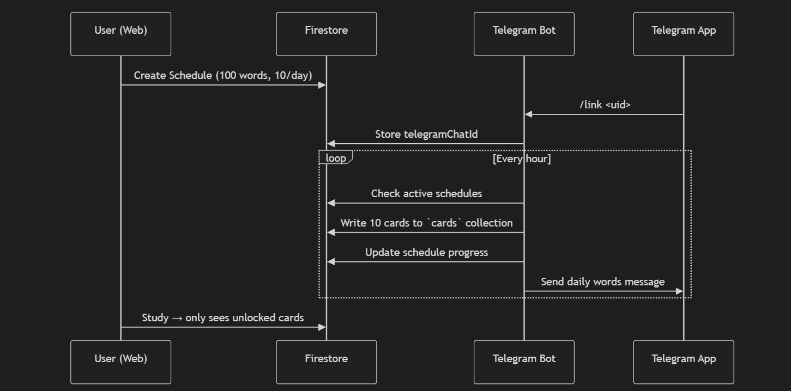
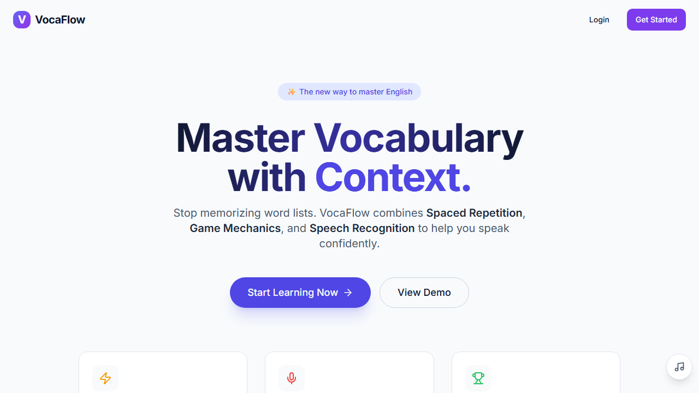
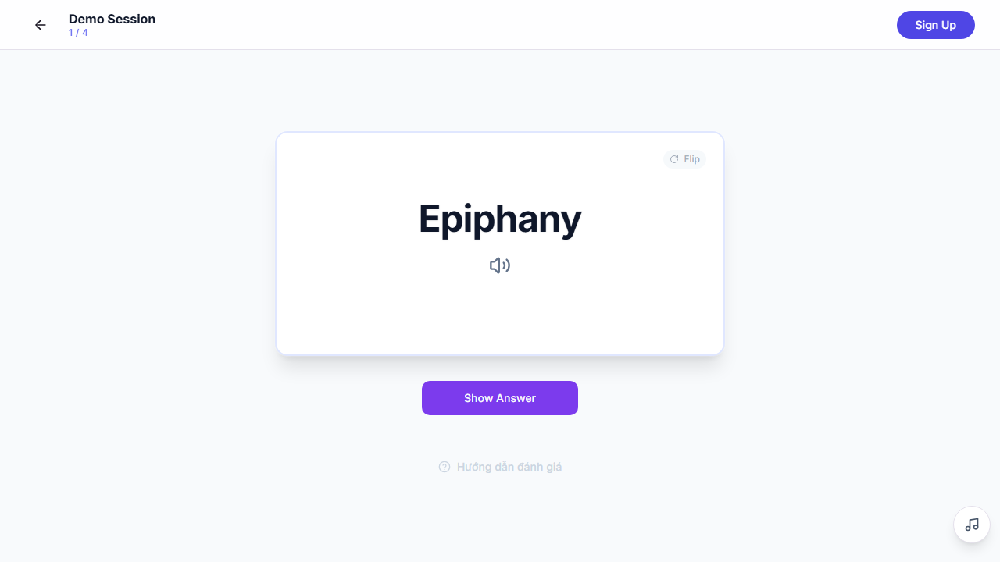
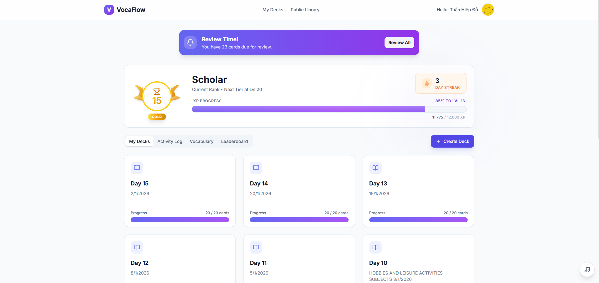
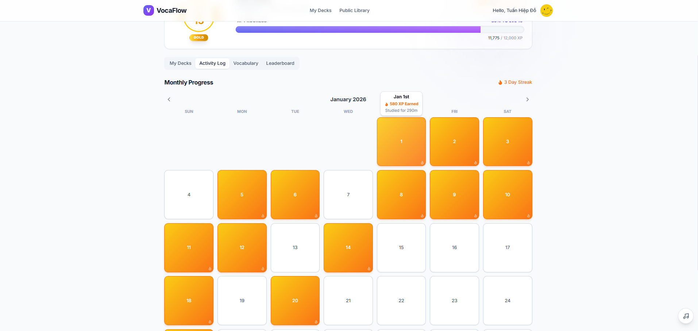
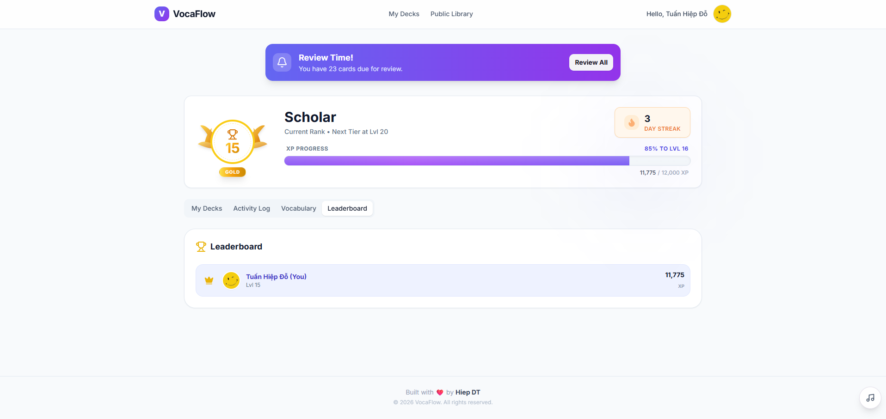
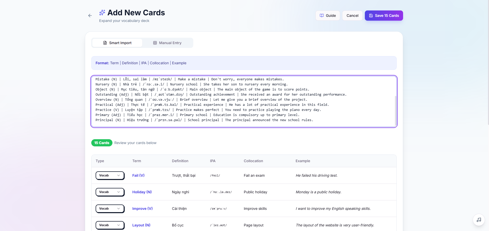
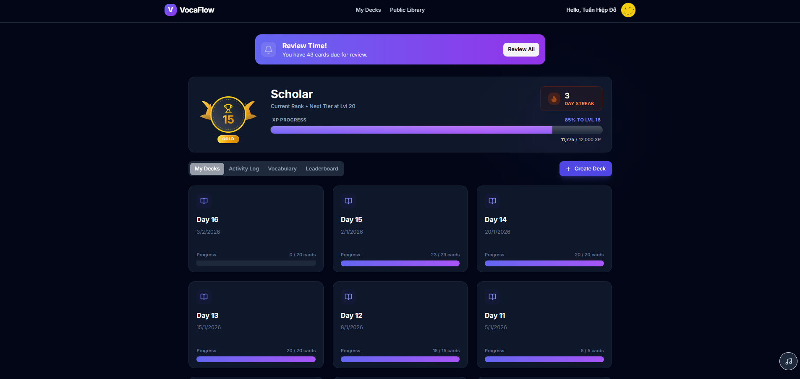

# VocaFlow 🌊

**A powerful, gamified English vocabulary learning platform.**

[](https://vocaflow-9ff5e.web.app)
[](https://react.dev)

## 📖 About

VocaFlow goes beyond simple flashcards. It combines **Spaced Repetition (SRS)** with **Speech Recognition** and **Game Mechanics** to make learning English vocabulary effective and addictive.

Built by **Hiep DT**.

## ✨ Features at a Glance

### 🎮 Study Modes

- **Flashcards**: Classic review with Text-to-Speech.
- **Cram Mode**: Review all cards in a deck instantly, ignoring SRS schedules.
- **Speaking Drill**: Practice your pronunciation with real-time feedback and audio visualization.
- **Sentence Scramble**: Unjumble sentences to master grammar and context.
- **Cloze Deletion**: Fill in the missing words to test your recall.

### 🏆 Gamification

- **Level Up**: Earn XP for every card you master. Climb from _Novice_ to _Legend_.
- **Streaks**: Keep your daily study habit alive.
- **Heatmap**: Visualize your consistency over the year.

### 🎨 Modern UI/UX

- **Soft & Clean Design**: A visually soothing interface with adaptive Dark Mode support.
- **Smooth Animations**: Powered by Framer Motion for a fluid feel.
- **Mobile Ready**: Fully responsive design with mobile-optimized views (e.g., Full Month Streak Calendar).

### 🛠️ Tools

- **Smart Import**: Quickly add dozens of words via text paste.
- **Dashboard**: Track your mastery of different decks.

## 🛠️ System Architecture

The following diagram illustrates how the Web App, Firestore, and the Telegram Bot interact to manage your daily vocabulary drip-feed.



## 📸 Screenshots

### ☀️ Light Mode

#### Landing Page



#### Interactive Demo



#### Dashboard



#### Activity Log



#### Leaderboard



#### Add New Cards



### 🌙 Dark Mode

#### Dashboard (Dark)


_The interface automatically adapts to your system theme._

## 🚀 Getting Started

### Prerequisites

- Node.js (v18 or higher)
- npm or pnpm

### Installation

1. Clone the repo:
   ```bash
   git clone https://github.com/hiep231/VocaFlow.git
   cd english
   ```
2. Install dependencies:
   ```bash
   npm install
   ```
3. Create a `.env` file with your Firebase credentials:
   ```env
   VITE_FIREBASE_API_KEY=...
   VITE_FIREBASE_AUTH_DOMAIN=...
   VITE_FIREBASE_PROJECT_ID=...
   ...
   ```
4. Start development server:
   ```bash
   npm run dev
   ```

## 📦 Deployment

The project is deployed on **Firebase Hosting**.

To deploy your own version:

1. Build the project:
   ```bash
   npm run build
   ```
2. Deploy:
   ```bash
   npm run deploy
   ```
   _(Make sure you have `firebase-tools` installed and logged in)_

## 📄 Documentation

For a detailed technical overview, check out the [Project Brief](./PROJECT_BRIEF.md).

---

_Built with ❤️ by Hiep DT_
